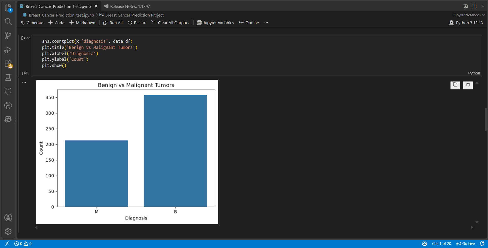
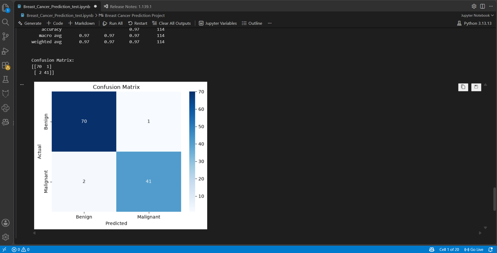
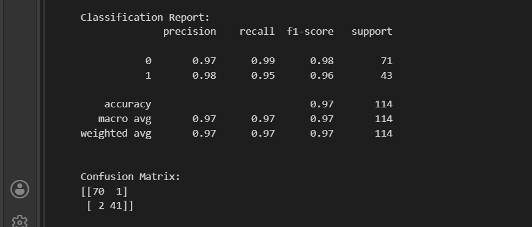

# Breast Cancer Prediction using Machine Learning

This is a beginner-level machine learning project where I worked on predicting whether a breast tumor is **benign** or **malignant** using Python and Logistic Regression.

The project helped me understand the basic workflow of a machine learning project, including data preprocessing, visualization, model training, and evaluation.

> **Note:** This project is created for educational purposes only. It is not a medical diagnostic tool.

---

## About the Project

The goal of this project is to build a machine learning model that can classify breast tumors into two categories:

- **Benign (B)** – non-cancerous
- **Malignant (M)** – cancerous

The dataset contains different measurements related to breast tumor characteristics. These features are used to train a Logistic Regression model.

---

## Dataset

The dataset used in this project is:

**Cancer_Data.csv**

It contains measurements of breast tumor characteristics along with the diagnosis.

The target variable is:

- `B` → Benign
- `M` → Malignant

Some unnecessary columns such as `id` and `Unnamed: 32` were removed during preprocessing.

---

## Machine Learning Model

I used **Logistic Regression** for classification.

Logistic Regression is a supervised machine learning algorithm commonly used for binary classification problems.

In this project, the model predicts:

```text
0 → Benign
1 → Malignant

## Tools and Libraries

The project was developed using Python and the following libraries:

Python
Pandas
NumPy
Matplotlib
Seaborn
Scikit-learn
Jupyter Notebook
VS Code


## Project Workflow
Cancer Dataset
      ↓
Load Data
      ↓
Clean Data
      ↓
Visualize Data
      ↓
Prepare Features and Target
      ↓
Train-Test Split
      ↓
Feature Scaling
      ↓
Logistic Regression
      ↓
Prediction
      ↓
Evaluation


## Data Preprocessing

Some of the preprocessing steps I performed were:

Removed unnecessary columns such as id and Unnamed: 32
Converted B and M into 0 and 1
Separated the input features from the target variable
Split the data into training and testing data
Standardized the features using StandardScaler


## Model Evaluation

After training the model, I evaluated its performance using:

Accuracy

Accuracy shows the percentage of predictions that were classified correctly.

Classification Report

The classification report gives information about:

Precision
Recall
F1-score
Support
Confusion Matrix

I also used a confusion matrix to see how many predictions were:

Correctly classified as benign
Correctly classified as malignant
Incorrectly classified as benign
Incorrectly classified as malignant

The actual results can be seen in the notebook.

## Results
Diagnosis Distribution

Confusion Matrix

Classification Report

Project Files
breast-cancer-prediction/
│
├── Breast_Cancer_Prediction_test.ipynb
├── Cancer_Data.csv
├── diagnosis_distribution.png
├── Conffusion_matrix_heatmap.png
├── Classification_Report.png
├── requirements.txt
├── .gitignore
└── README.md
How to Run

If you want to try the project yourself:

1. Clone the repository
git clone https://github.com/RiyathePaul/breast-cancer-prediction.git
2. Open the project folder
cd breast-cancer-prediction
3. Install the required libraries
pip install -r requirements.txt
4. Open the notebook

Open:

Breast_Cancer_Prediction_test.ipynb

in Jupyter Notebook or VS Code.

5. Run the cells

Run the cells from top to bottom to load the dataset, train the model, and see the results.

What I Learned

While working on this project, I got hands-on practice with:

Loading and working with datasets
Cleaning data
Visualizing data
Preparing data for machine learning
Splitting data into training and testing sets
Feature scaling
Logistic Regression
Making predictions
Understanding classification reports
Reading a confusion matrix

This project also helped me understand how the different steps of a basic machine learning project fit together.

Future Improvements

There are several things I could add to this project in the future, such as:

Trying other classification algorithms
Comparing the performance of different models
Hyperparameter tuning
Cross-validation
ROC-AUC analysis
Adding more visualizations
Creating a simple web interface for making predictions
Author

Riya Paul

This project was created as part of my learning journey in Python and Machine Learning.


**Important:** After pasting this, make sure those **3 PNG files are in the same root folder as `README.md`** on GitHub. Then commit the README and refresh the repository page.
